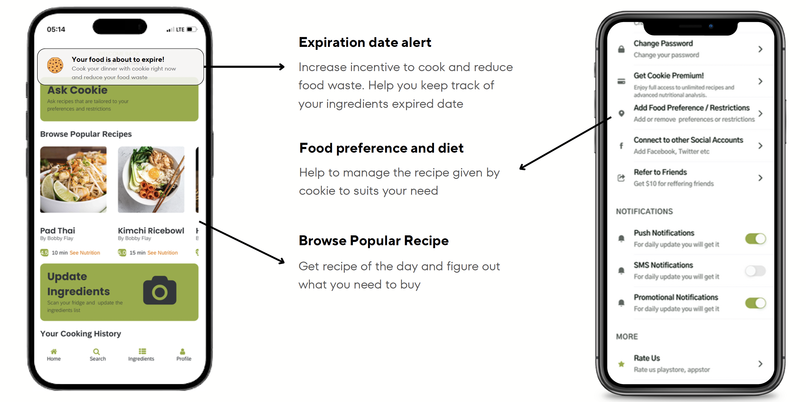

# COOKIE

**Cookie** is an innovative solution designed to combat food waste and simplify meal preparation. It empowers users by scanning the contents of their refrigerator to recognize ingredients, track expiration dates, and provide personalized recipe suggestions. The app integrates advanced technologies such as GPT-4 for ingredient recognition, real-time notifications, and recipe optimization, making meal planning more efficient and budget-friendly.

### Architecture Diagram

### UI

